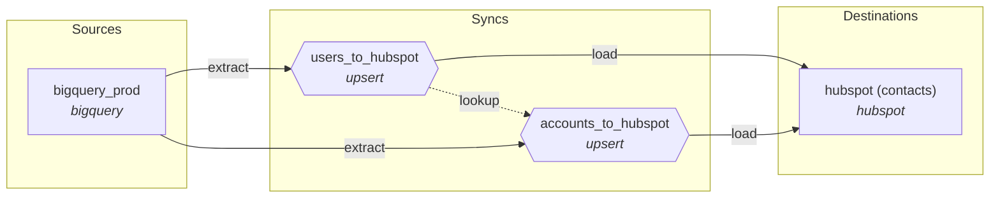

<div align="center">

<picture>
  <source media="(prefers-color-scheme: dark)" srcset="https://raw.githubusercontent.com/drt-hub/.github/main/profile/assets/logo-dark.svg">
  
</picture>

# drt — data reverse tool

**Reverse ETL for the code-first data stack.**

[](https://github.com/drt-hub/drt/actions/workflows/ci.yml)
[](https://codecov.io/gh/drt-hub/drt)
[](https://pypi.org/project/drt-core/)
[](https://pypi.org/project/drt-core/)
[](LICENSE)

[](https://pepy.tech/projects/drt-core)
[](https://pepy.tech/projects/dagster-drt)
[](https://github.com/sponsors/masukai)
[](https://drt-hub.github.io/drt-web/)
[](https://x.com/drt_hub)

<!-- ALL-CONTRIBUTORS-BADGE:START - Do not remove or modify this section -->
[](#contributors-)
<!-- ALL-CONTRIBUTORS-BADGE:END -->

</div>

**drt** syncs data from your data warehouse to external services — declaratively, via YAML and CLI.
Think `dbt run` → `drt run`. Same developer experience, opposite data direction.

<p align="center">
  
</p>

```bash
pip install drt-core          # core (DuckDB included)
drt init && drt run
```

<p align="center">
  <a href="https://codespaces.new/drt-hub/drt"></a> — or try it in your browser, zero local setup.
</p>

---

## Why drt?

| Problem                              | drt's answer             |
| ------------------------------------ | ------------------------ |
| Census/Hightouch are expensive SaaS  | Free, self-hosted OSS    |
| GUI-first tools don't fit CI/CD      | CLI + YAML, Git-native   |
| dbt/dlt ecosystem has no reverse leg | Same philosophy, same DX |
| LLM/MCP era makes GUI SaaS overkill  | LLM-native by design     |

> **What's always free?** All connectors, CLI, MCP server, and sync engine. See [OPEN_CORE.md](./OPEN_CORE.md) for the open core boundary.

---

## Quickstart

No cloud accounts needed — DuckDB + httpbin.org, three commands.

```bash
pip install drt-core
mkdir my-drt-project && cd my-drt-project
drt init --template duckdb_to_rest
```

That scaffolds a runnable `syncs/duckdb_to_rest.yml`. Seed a tiny
DuckDB table and run:

```bash
python -c "
import duckdb
c = duckdb.connect('warehouse.duckdb')
c.execute('''CREATE TABLE IF NOT EXISTS users AS SELECT * FROM (VALUES
  (1, 'Alice', 'alice@example.com'),
  (2, 'Bob',   'bob@example.com'),
  (3, 'Carol', 'carol@example.com')
) t(id, name, email)''')
c.close()
"
drt run --dry-run   # preview, no data sent
drt run             # POST each row to httpbin.org
drt status          # check results
```

### Other starter templates

```bash
drt init --template list             # see all available templates
drt init --template postgres_to_slack
drt init --template duckdb_to_hubspot
```

Each template prints next-steps for the env vars / source data it needs.
See [examples/](examples/) for the full collection (Discord, Google
Sheets, GitHub Actions, MySQL, ClickHouse, BigQuery, …) and
[docs/connectors/](docs/connectors/) for per-connector reference.

### Customizing your sync

For a guided wizard that walks you through profile + project setup:

```bash
drt init   # interactive — picks a source, configures profile, scaffolds project
```

Both flows produce the same project shape (`drt_project.yml`, `syncs/`,
`.drt/`). `drt sources --detailed` and `drt destinations --detailed`
print every connector's required env vars and a sample YAML stanza —
useful when hand-authoring beyond the templates.

---

## CLI Reference

```bash
drt init                    # initialize project
drt list                    # list sync definitions
drt sources                 # list available source connectors
drt destinations            # list available destination connectors
drt run                     # run all syncs
drt run --select <name>     # run a specific sync
drt run --all               # discover and run all syncs
drt run --select tag:<tag>  # run syncs matching a tag
drt run --threads 4         # parallel sync execution
drt run --dry-run           # dry run
drt run --verbose           # show row-level error details
drt run --output json       # structured JSON output for CI/scripting
drt run --log-format json   # structured JSON logging to stderr
drt run --profile prd       # override profile (or DRT_PROFILE env var)
drt run --cursor-value '…'  # override watermark cursor for backfill
drt test                    # run post-sync validation tests
drt test --select <name>    # test a specific sync
drt validate                # validate sync YAML configs
drt status                  # show recent sync status
drt status --output json    # JSON output for status
drt profile list            # list credential profiles in ~/.drt/profiles.yml
drt profile show <name>     # show a profile (secrets masked)
drt profile test <name>     # verify a profile's source connectivity
drt profile add <name>      # interactively add a profile
drt profile remove <name>   # remove a profile
drt serve                   # start HTTP webhook endpoint
drt docs generate --format mermaid  # print project DAG as Mermaid
drt mcp run                 # start MCP server (requires drt-core[mcp])
drt --install-completion    # install shell completion (bash/zsh/fish)
drt --show-completion       # show completion script
```

### Visualize your syncs

Generate a Mermaid DAG from your local `drt_project.yml` and `syncs/*.yml` files:

```bash
drt docs generate --format mermaid > dag.md
```



### Shell completion

Shell completion is supported for bash, zsh, and fish:

```bash
# Recommended: auto-install for your current shell (idempotent)
drt --install-completion

# Or manually add to your shell config (run once from the target shell)
drt --show-completion >> ~/.bashrc   # bash
drt --show-completion >> ~/.zshrc    # zsh
drt --show-completion > ~/.config/fish/completions/drt.fish  # fish
```

> **Note:** `--show-completion` outputs the script for your _current_ shell. Run it from the shell you want to configure. The manual `>>` append is not idempotent — run it once only.

After installation, restart your shell and tab-complete commands and options.

---

## MCP Server

Connect drt to Claude, Cursor, or any MCP-compatible client so you can run syncs, check status, and validate configs without leaving your AI environment.

```bash
pip install drt-core[mcp]
drt mcp run
```

**Claude Desktop** (`~/Library/Application Support/Claude/claude_desktop_config.json`):

```json
{
  "mcpServers": {
    "drt": {
      "command": "drt",
      "args": ["mcp", "run"]
    }
  }
}
```

**Available MCP tools:**

| Tool                  | What it does                                                                          |
| --------------------- | ------------------------------------------------------------------------------------- |
| `drt_list_syncs`      | List all sync definitions                                                             |
| `drt_run_sync`        | Run a sync (supports `dry_run` + `compute_diff` for `--diff` parity)                  |
| `drt_run_test`        | Run post-sync validation tests (mirrors `drt test`)                                   |
| `drt_get_status`      | Get last run result(s)                                                                |
| `drt_get_history`     | Get recent sync run history                                                           |
| `drt_validate`        | Validate sync YAML configs                                                            |
| `drt_get_schema`      | Return JSON Schema for config files                                                   |
| `drt_list_connectors` | List available sources and destinations                                               |
| `drt_dlq`             | Inspect a sync's Dead Letter Queue (depth + failed records)                           |
| `drt_retry`           | Replay a sync's Dead Letter Queue (mirrors `drt retry`)                               |
| `drt_get_manifest`    | Machine-readable sync catalog + lineage (`drt docs` JSON)                             |
| `drt_list_profiles`   | List credential profiles (name + type, no secrets)                                    |
| `drt_test_profile`    | Connectivity check for a credential profile                                            |
| `drt_doctor`          | Environment diagnostics (mirrors `drt doctor`)                                        |

---

## AI Skills for Claude Code

Install the official Claude Code skills to generate YAML, debug failures, and migrate from other tools — all from the chat interface.

### Install via Plugin Marketplace (recommended)

```bash
/plugin marketplace add drt-hub/drt
/plugin install drt@drt-hub
```

> **Tip:** Enable auto-update so you always get the latest skills when drt is updated:
> `/plugin` → Marketplaces → drt-hub → Enable auto-update

### Manual install (slash commands)

Copy the files from `.claude/commands/` into your drt project's `.claude/commands/` directory.

| Skill              | Trigger               | What it does                               |
| ------------------ | --------------------- | ------------------------------------------ |
| `/drt-create-sync`  | "create a sync"        | Generates valid sync YAML from your intent       |
| `/drt-debug`        | "sync failed"          | Diagnoses a specific error and suggests fixes    |
| `/drt-troubleshoot` | "drt isn't working"    | Walks a full top-to-bottom diagnostic checklist  |
| `/drt-init`         | "set up drt"           | Guides through project initialization            |
| `/drt-migrate`      | "migrate from Census"  | Converts existing configs to drt YAML            |

---

## Connectors

> Per-connector reference: [docs/connectors/](docs/connectors/) · Discoverable from the CLI: `drt sources --detailed` / `drt destinations --detailed`

### Sources

| Connector  | Status    | Install                            | Auth                                          |
| ---------- | --------- | ---------------------------------- | --------------------------------------------- |
| BigQuery   | ✅ v0.1   | `pip install drt-core[bigquery]`   | Application Default / Service Account Keyfile |
| DuckDB     | ✅ v0.1   | (core)                             | File path                                     |
| PostgreSQL | ✅ v0.1   | `pip install drt-core[postgres]`   | Password (env var)                            |
| Snowflake  | ✅ v0.5   | `pip install drt-core[snowflake]`  | Password (env var)                            |
| SQLite     | ✅ v0.4.2 | (core)                             | File path                                     |
| Redshift   | ✅ v0.3.4 | `pip install drt-core[redshift]`   | Password (env var)                            |
| ClickHouse | ✅ v0.4.3 | `pip install drt-core[clickhouse]` | Password (env var)                            |
| MySQL      | ✅ v0.5   | `pip install drt-core[mysql]`      | Password (env var)                            |
| Databricks | ✅ v0.6   | `pip install drt-core[databricks]` | Access Token (env var)                        |
| Delta Lake | ✅ v0.8   | `pip install drt-core[deltalake]` | Storage options (env var)                     |
| Iceberg    | ✅ v0.8   | `pip install drt-core[iceberg]`    | Catalog properties (env var)                  |
| SQL Server | ✅ v0.6   | `pip install drt-core[sqlserver]`  | Password (env var)                            |
| REST API   | ✅ v0.7   | (core)                             | Bearer / API Key / Basic / OAuth2             |

### Destinations

<details>
<summary><b>34 destinations</b> — warehouses, SaaS APIs, cloud storage, files &amp; webhooks (click to expand)</summary>

| Connector               | Status    | Install                            | Auth                              |
| ----------------------- | --------- | ---------------------------------- | --------------------------------- |
| REST API                | ✅ v0.1   | (core)                             | Bearer / API Key / Basic / OAuth2 |
| Slack Incoming Webhook  | ✅ v0.1   | (core)                             | Webhook URL                       |
| Discord Webhook         | ✅ v0.4.2 | (core)                             | Webhook URL                       |
| GitHub Actions          | ✅ v0.1   | (core)                             | Token (env var)                   |
| HubSpot                 | ✅ v0.1   | (core)                             | Token (env var)                   |
| Zendesk                 | ✅ v0.7   | (core)                             | Basic (email + API token)         |
| Amplitude               | ✅ v0.7   | (core)                             | Project API key (env var)         |
| Klaviyo                 | ✅ v0.8   | (core)                             | Private API key (env var)         |
| Mixpanel                | ✅ v0.8   | (core)                             | Project token / service account   |
| Google Ads              | ✅ v0.6   | (core)                             | OAuth2 Client Credentials         |
| Google Sheets           | ✅ v0.4   | `pip install drt-core[sheets]`     | Service Account Keyfile           |
| PostgreSQL (upsert)     | ✅ v0.4   | `pip install drt-core[postgres]`   | Password (env var)                |
| MySQL (upsert)          | ✅ v0.4   | `pip install drt-core[mysql]`      | Password (env var)                |
| ClickHouse              | ✅ v0.5   | `pip install drt-core[clickhouse]` | Password (env var)                |
| Parquet file            | ✅ v0.5   | `pip install drt-core[parquet]`    | File path                         |
| Amazon S3               | ✅ v0.7.9 | `pip install drt-core[s3]`         | AWS credential chain / env vars   |
| Google Cloud Storage    | ✅ v0.7.9 | `pip install drt-core[gcs]`        | Application Default / Service Account Keyfile |
| Azure Blob Storage      | ✅ v0.7.9 | `pip install drt-core[azure]`      | Connection string env / DefaultAzureCredential |
| Microsoft Teams Webhook | ✅ v0.5   | (core)                             | Webhook URL                       |
| CSV / JSON / JSONL file | ✅ v0.5   | (core)                             | File path                         |
| Jira                    | ✅ v0.5   | (core)                             | Basic (email + API token)         |
| Linear                  | ✅ v0.5   | (core)                             | API Key (env var)                 |
| SendGrid                | ✅ v0.5   | (core)                             | API Key (env var)                 |
| Notion                  | ✅ v0.6   | (core)                             | Bearer Token (env var)            |
| Airtable                | ✅ v0.8   | (core)                             | Personal Access Token (env var)   |
| Twilio SMS              | ✅ v0.6   | (core)                             | Basic (Account SID + Auth Token)  |
| Intercom                | ✅ v0.6   | (core)                             | Bearer Token (env var)            |
| Email SMTP              | ✅ v0.6   | (core)                             | Username / Password (env var)     |
| Salesforce Bulk API 2.0 | ✅ v0.6   | (core)                             | OAuth2 (username-password)        |
| Staged Upload           | ✅ v0.6   | (core)                             | Configurable per provider         |
| Elasticsearch / OpenSearch | ✅ v0.7.9 | (core)                          | API key / HTTP Basic (env var)    |
| Snowflake               | ✅ v0.7   | `pip install drt-core[snowflake]`  | Password (env var)                |
| Databricks Delta Lake   | ✅ v0.7.9 | `pip install drt-core[databricks]` | Personal Access Token (env var)   |
| BigQuery                | ✅ v0.8   | `pip install drt-core[bigquery]`   | ADC / Service Account keyfile     |

</details>

### Integrations

| Connector           | Status  | Install                   |
| ------------------- | ------- | ------------------------- |
| Dagster             | ✅ v0.4 | `pip install dagster-drt` |
| Prefect             | ✅ v0.6 | (core)                    |
| Airflow             | ✅ v0.6 | (core)                    |
| dbt manifest reader | ✅ v0.4 | (core)                    |

---

## Roadmap

> **Upcoming releases → [ROADMAP.md](ROADMAP.md)** (scope, themes, targets)
> **Issue-level tracking → [GitHub Milestones](https://github.com/drt-hub/drt/milestones)**
> **Looking to contribute? → [Good First Issues](https://github.com/drt-hub/drt/issues?q=is%3Aopen+label%3A%22good+first+issue%22)**

**Shipped:** now on **v0.7.10** — co-writer-safe mirror · Delta Lake + Iceberg sources · PII masking · Klaviyo + Airtable · VS Code extension. Grouped milestones below; the full per-release changelog lives in [CHANGELOG.md](CHANGELOG.md) and [GitHub Releases](https://github.com/drt-hub/drt/releases).

| Milestone            | Highlights                                                                                                                                                             |
| -------------------- | -------------------------------------------------------------------------------------------------------------------------------------------------------------------- |
| **v0.1–0.3**         | Core CLI · BigQuery / DuckDB / Postgres sources · REST / Slack / HubSpot destinations · incremental sync · MCP server + AI Skills for Claude Code                       |
| **v0.4–0.6**         | 20+ destinations (Sheets, SQL upserts, Notion, Twilio, Salesforce…) · dagster-drt / Airflow / Prefect · `drt test` · parallel `--threads` · JSON Schema validation     |
| **v0.7** ✅          | **Production Ready** — graceful shutdown · sync history · atomic table swaps · `drt doctor` · opt-in telemetry · `sync.mode: mirror` · DLQ + `drt profile`              |
| **v0.7.9–0.7.10** ✅ | Cloud destinations (S3 / GCS / Azure / Databricks / BigQuery / Elasticsearch) · Delta Lake + Iceberg sources · tracked & scoped mirror · PII masking · VS Code extension |

**Next:** [v0.8 Cloud Destinations & Growth](ROADMAP.md#v08--cloud-destinations--growth) → [v0.9 Enterprise Foundation](ROADMAP.md#v09--enterprise-foundation) → [v1.0 Stable Release](ROADMAP.md#v10--stable-release) → [v1.x Rust Engine](ROADMAP.md#v1x--rust-engine)

---

## Orchestration: dagster-drt

Community-maintained [Dagster](https://dagster.io/) integration. Expose drt syncs as Dagster assets with full observability.

```bash
pip install dagster-drt
```

```python
from dagster import AssetExecutionContext, Definitions
from dagster_drt import drt_assets, DagsterDrtResource

@drt_assets(project_dir="path/to/drt-project")
def my_syncs(context: AssetExecutionContext, drt: DagsterDrtResource):
    yield from drt.run(context=context)

defs = Definitions(
    assets=[my_syncs],
    resources={"drt": DagsterDrtResource(project_dir="path/to/drt-project")},
)
```

See [dagster-drt README](integrations/dagster-drt/README.md) for full API docs (Translator, Pipes support, DrtConfig dry-run, MaterializeResult).

---

## CI/CD: GitHub Action

Run drt syncs straight from CI/CD with the official [**drt-hub/drt-action**](https://github.com/drt-hub/drt-action) — no infrastructure, just a few lines of YAML. Trigger on a schedule, on every push, or right after dbt finishes.

```yaml
- uses: drt-hub/drt-action@v1
  with:
    select: '*'
    extras: postgres
  env:
    PG_PASSWORD: ${{ secrets.PG_PASSWORD }}
```

Inputs cover sync selection (`select`), connector `extras`, `profile`, `dry-run` and `threads`; outputs expose `status`, `succeeded`, `failed` and `duration-seconds` (plus a step-summary table). Secrets are passed via `env:` and resolved by drt's `*_env` keys. See the [action README](https://github.com/drt-hub/drt-action#readme) for the secrets pattern and more examples (run-after-dbt, PR preview).

---

## Ecosystem

drt is designed to work alongside, not against, the modern data stack:

<p align="center">
  
</p>

---

## Telemetry

drt collects **no telemetry by default**. Opting in helps us understand which sources / destinations / sync modes are actually used, so we can prioritise.

```bash
drt config set telemetry.enabled true     # opt in
drt config show-telemetry                 # preview the exact payload that would be sent
drt config set telemetry.enabled false    # opt out
DO_NOT_TRACK=1 drt run                    # universal kill switch — overrides everything
```

When opted in, drt sends one `sync_completed` event per sync. The **only `properties`** we collect are these 9 fields: `drt_version`, `python_version`, `os`, `source_type`, `destination_type`, `sync_mode`, `rows_synced`, `duration_seconds`, `status`. The wire envelope additionally carries `event`, `distinct_id` (a per-machine random UUID at `~/.drt/.anonymous_id`), `timestamp`, and `api_key`. Sync names, model SQL, destination URLs, credentials, and project paths are **never** transmitted — the allow-list is enforced at the function-signature level in [`drt/telemetry.py`](drt/telemetry.py). By default events go to **PostHog Cloud (EU region)**; override with `DRT_TELEMETRY_ENDPOINT` and `DRT_TELEMETRY_API_KEY` for self-hosted PostHog or a custom collector.

> Note: drt itself never transmits your IP, but the receiving PostHog backend records the TCP source IP as `$ip`. See [docs/telemetry.md](docs/telemetry.md) for details and how to disable / substitute the backend.

For full details see [docs/telemetry.md](docs/telemetry.md).

## Contributing

We welcome contributions of all sizes — from typo fixes to new connectors. drt has a transparent [contributor ladder](GOVERNANCE.md#roles) so your work builds toward greater trust and responsibility over time.

- **Get started:** [CONTRIBUTING.md](CONTRIBUTING.md) — setup, workflow, and your first connector tutorial
- **Pick something to work on:** [Good First Issues](https://github.com/drt-hub/drt/issues?q=is%3Aopen+label%3A%22good+first+issue%22)
- **Understand how decisions are made:** [GOVERNANCE.md](GOVERNANCE.md)
- **What's free vs. enterprise:** [OPEN_CORE.md](OPEN_CORE.md)
- **Versioning & breaking changes:** [VERSIONING.md](VERSIONING.md)

## Contributors ✨

Every contribution — code, docs, bug reports, ideas — makes drt better. Thank you 💜

<p align="center">
  <a href="https://github.com/drt-hub/drt/graphs/contributors">
    
  </a>
</p>

<details>
<summary>Full credits by contribution type (<a href="https://allcontributors.org/docs/en/emoji-key">emoji key</a>)</summary>

<br>

<!-- ALL-CONTRIBUTORS-LIST:START - Do not remove or modify this section -->
<!-- prettier-ignore-start -->
<!-- markdownlint-disable -->
<table>
  <tbody>
    <tr>
      <td align="center" valign="top" width="14.28%"><a href="https://masukai.github.io/portfolio/"><br /><sub><b>K.Masuda</b></sub></a><br /><a href="https://github.com/drt-hub/drt/commits?author=masukai" title="Code">💻</a> <a href="https://github.com/drt-hub/drt/commits?author=masukai" title="Documentation">📖</a> <a href="#maintenance-masukai" title="Maintenance">🚧</a> <a href="#ideas-masukai" title="Ideas, Planning, & Feedback">🤔</a> <a href="#tool-masukai" title="Tools">🔧</a> <a href="#projectManagement-masukai" title="Project Management">📆</a> <a href="https://github.com/drt-hub/drt/pulls?q=is%3Apr+reviewed-by%3Amasukai" title="Reviewed Pull Requests">👀</a> <a href="#mentoring-masukai" title="Mentoring">🧑‍🏫</a></td>
      <td align="center" valign="top" width="14.28%"><a href="https://github.com/yodakanohoshi"><br /><sub><b>yodakanohoshi</b></sub></a><br /><a href="https://github.com/drt-hub/drt/commits?author=yodakanohoshi" title="Code">💻</a> <a href="https://github.com/drt-hub/drt/commits?author=yodakanohoshi" title="Documentation">📖</a> <a href="#maintenance-yodakanohoshi" title="Maintenance">🚧</a> <a href="#ideas-yodakanohoshi" title="Ideas, Planning, & Feedback">🤔</a> <a href="https://github.com/drt-hub/drt/pulls?q=is%3Apr+reviewed-by%3Ayodakanohoshi" title="Reviewed Pull Requests">👀</a> <a href="#projectManagement-yodakanohoshi" title="Project Management">📆</a></td>
      <td align="center" valign="top" width="14.28%"><a href="https://muawiya-contact.github.io/muawiya-portfolio/"><br /><sub><b>Moavia Amir</b></sub></a><br /><a href="https://github.com/drt-hub/drt/commits?author=Muawiya-contact" title="Code">💻</a> <a href="https://github.com/drt-hub/drt/commits?author=Muawiya-contact" title="Documentation">📖</a> <a href="#infra-Muawiya-contact" title="Infrastructure (Hosting, Build-Tools, etc)">🚇</a> <a href="#maintenance-Muawiya-contact" title="Maintenance">🚧</a> <a href="#ideas-Muawiya-contact" title="Ideas, Planning, & Feedback">🤔</a></td>
      <td align="center" valign="top" width="14.28%"><a href="https://github.com/Khush-domadia"><br /><sub><b>Khush Domadiya</b></sub></a><br /><a href="https://github.com/drt-hub/drt/commits?author=Khush-domadia" title="Code">💻</a></td>
      <td align="center" valign="top" width="14.28%"><a href="https://pawansingh3889.github.io/"><br /><sub><b>Pawan Singh Kapkoti</b></sub></a><br /><a href="https://github.com/drt-hub/drt/commits?author=Pawansingh3889" title="Code">💻</a></td>
      <td align="center" valign="top" width="14.28%"><a href="https://github.com/PFCAaron12"><br /><sub><b>PFCAaron12</b></sub></a><br /><a href="https://github.com/drt-hub/drt/commits?author=PFCAaron12" title="Code">💻</a></td>
      <td align="center" valign="top" width="14.28%"><a href="https://github.com/Photon101"><br /><sub><b>Semy Ingle</b></sub></a><br /><a href="https://github.com/drt-hub/drt/commits?author=Photon101" title="Code">💻</a> <a href="#maintenance-Photon101" title="Maintenance">🚧</a></td>
    </tr>
    <tr>
      <td align="center" valign="top" width="14.28%"><a href="https://kiwamizamurai.github.io/"><br /><sub><b>きわみざむらい</b></sub></a><br /><a href="https://github.com/drt-hub/drt/commits?author=kiwamizamurai" title="Code">💻</a> <a href="https://github.com/drt-hub/drt/issues?q=author%3Akiwamizamurai" title="Bug reports">🐛</a></td>
      <td align="center" valign="top" width="14.28%"><a href="https://github.com/armorbreak001"><br /><sub><b>armorbreak001</b></sub></a><br /><a href="https://github.com/drt-hub/drt/commits?author=armorbreak001" title="Code">💻</a></td>
      <td align="center" valign="top" width="14.28%"><a href="https://github.com/pureqin"><br /><sub><b>pureqin</b></sub></a><br /><a href="https://github.com/drt-hub/drt/commits?author=pureqin" title="Code">💻</a></td>
      <td align="center" valign="top" width="14.28%"><a href="https://github.com/wahajahmed010"><br /><sub><b>Wahaj Ahmed</b></sub></a><br /><a href="https://github.com/drt-hub/drt/commits?author=wahajahmed010" title="Code">💻</a></td>
      <td align="center" valign="top" width="14.28%"><a href="https://github.com/cian-ps"><br /><sub><b>cian-ps</b></sub></a><br /><a href="https://github.com/drt-hub/drt/commits?author=cian-ps" title="Code">💻</a> <a href="https://github.com/drt-hub/drt/issues?q=author%3Acian-ps" title="Bug reports">🐛</a> <a href="#infra-cian-ps" title="Infrastructure (Hosting, Build-Tools, etc)">🚇</a></td>
      <td align="center" valign="top" width="14.28%"><a href="https://github.com/xtreellaDev"><br /><sub><b>Erik Estrella</b></sub></a><br /><a href="https://github.com/drt-hub/drt/commits?author=xtreellaDev" title="Tests">⚠️</a></td>
      <td align="center" valign="top" width="14.28%"><a href="https://github.com/Ai-chan-0411"><br /><sub><b>Ai (藍)</b></sub></a><br /><a href="https://github.com/drt-hub/drt/commits?author=Ai-chan-0411" title="Documentation">📖</a></td>
    </tr>
    <tr>
      <td align="center" valign="top" width="14.28%"><a href="https://github.com/GokulKashyap"><br /><sub><b>GokulKashyap</b></sub></a><br /><a href="https://github.com/drt-hub/drt/commits?author=GokulKashyap" title="Code">💻</a> <a href="https://github.com/drt-hub/drt/commits?author=GokulKashyap" title="Tests">⚠️</a></td>
    </tr>
  </tbody>
  <tfoot>
    <tr>
      <td align="center" size="13px" colspan="7">
        
          <a href="https://all-contributors.js.org/docs/en/bot/usage">Add your contributions</a>
        </img>
      </td>
    </tr>
  </tfoot>
</table>

<!-- markdownlint-restore -->
<!-- prettier-ignore-end -->

<!-- ALL-CONTRIBUTORS-LIST:END -->

</details>

## Disclaimer

drt is an independent open-source project and is **not affiliated with,
endorsed by, or sponsored by** dbt Labs, dlt-hub, or any other company.

"dbt" is a registered trademark of dbt Labs, Inc.
"dlt" is a project maintained by dlt-hub.

drt is designed to complement these tools as part of the modern data stack,
but is a separate project with its own codebase and maintainers.

## License

Apache 2.0 — see [LICENSE](LICENSE).
